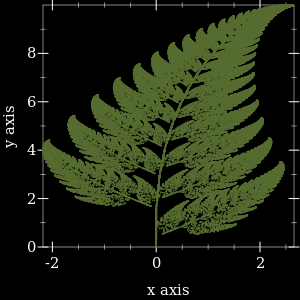
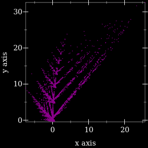
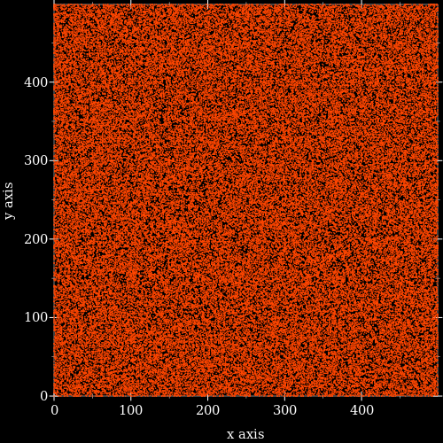
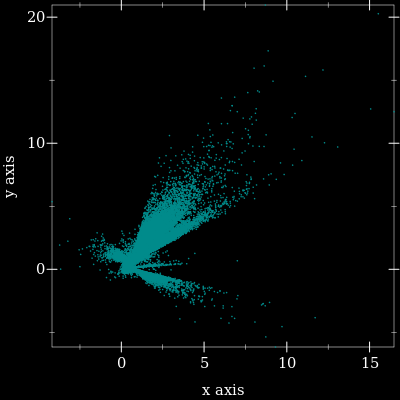
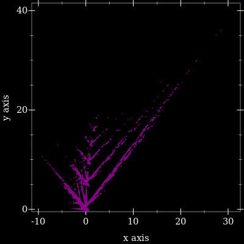
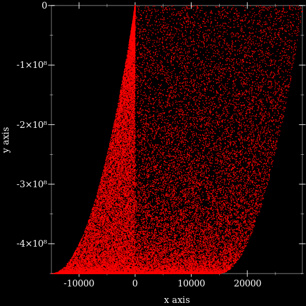

# generative-art

Lisp [Racket Scheme](https://racket-lang.org/) programs to draw digital art.

These experiments started here: [https://en.wikipedia.org/wiki/Barnsley_fern](https://en.wikipedia.org/wiki/Barnsley_fern).

## Leaf

[source](src/leaf)

## Palm

[source](src/palm)

## Walker

[source](src/walker)

## Zvezda

[source](src/zvezda)

## Branches

[source](src/branches)

## xyInverse

[source](src/xyinverse)

